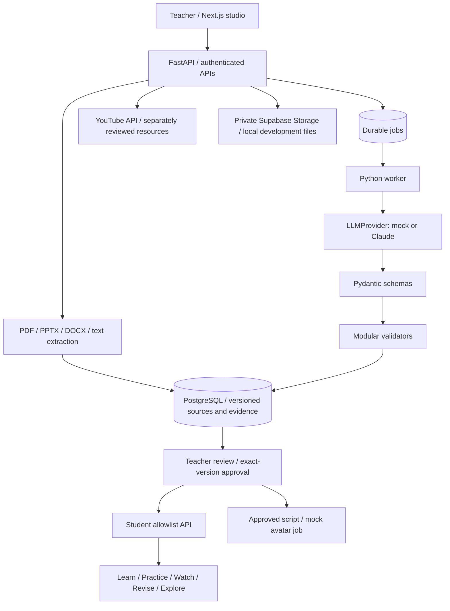

# Architecture and trust boundaries

## Authoritative state

- Relational SQLAlchemy models live in `backend/app/models/entities.py`.
- SQL migration: `backend/migrations/001_initial.sql`.
- PostgreSQL is the deployment database. SQLite is an explicit local/test adapter.
- Source documents have immutable versions and SHA-256 hashes; chunks retain page,
  slide, paragraph or teacher-note locations. Evidence is a separate relational entity.
- Source replacement never rewrites historical chunks or asset evidence links.
- Asset payloads use JSON for flexible text/questions, while identity, objectives,
  evidence links, claims, checks, approvals, jobs and history remain relational.
- Each asset has a current draft pointer and a published pointer. A new draft does not
  replace the old approved student version. A source/contract change invalidates
  publication eligibility until dependent assets are regenerated and approved.
- Contract and objective text snapshots are recorded in generated version settings.
- Pack timeline revisions are audit events; asset version numbers are independent.

## Generation commits

The HTTP API returns a queued job, not a completed fake response. The worker claims the
job, performs provider work outside the database transaction, validates the result,
then compares the expected pack revision before committing all generated items.
An edit, approval or source change during generation makes the job fail rather than
silently overwrite another decision. Failures leave existing assets unchanged.

The initial database queue avoids Redis/Celery deployment overhead. Its contract is
separable from provider and pack services. PostgreSQL workers use SKIP LOCKED. Use a
single worker with SQLite. Jobs survive restart; an interrupted Running job must be
cancelled and retried. Automatic leases/heartbeats and recovery are future work.

## Approval and student boundary

Approval is a transaction, not a UI badge. FAIL checks and stale dependencies block
approval. A teacher must explicitly attest to reviewing warnings and semantic checks.
Approvals refer to immutable asset versions and include actor, note and timestamp.

Student APIs do not serialize teacher objects then hide fields in CSS. They build a
small allowlist containing title, body, question options and public IDs. Keys and
solutions remain server-side; checking an answer returns correctness, and optionally
a solution when the teacher's answer-reveal policy allows it. This is formative
practice, not secure/high-stakes assessment: repeated attempts can infer answers.

Student URLs are unguessable bearer-capability share links, not classroom enrollment.
Anyone with a link can view the approved pack. Do not use them for sensitive/student
personal data. Link rotation, enrollment and attempt rate limiting are future work.

## Honest checks

Deterministic: schema, source/evidence resolution, location, key structure, word limit,
answer-key derivation, staleness and permissions. Text similarity flags duplicates.
Difficulty checks test tag consistency and require review of cognitive demand.
Grounding entailment, semantic leakage, mathematical correctness, terminology and
cross-artifact contradictions are not proven by this MVP. They remain NEEDS REVIEW.
A relational claim registry stores links; it is not a semantic theorem prover.

## Provider behavior

`LLM_PROVIDER=mock` is visible throughout the teacher UI. Fresh inputs get extractive
practice drafts. The explicit Newton demo includes teacher-authored questions, tied to
the hash of its original source; these are fixtures, not live generation. There is no
silent fallback from Claude failure to mock output.

Claude uses a source-data-only instruction, structured schema validation and returned
IDs checked against the unit's evidence. Prompt injection protection is best effort;
source content never becomes a system prompt, but model safety is not guaranteed.

Video is only a workflow simulation: Queued → Rendering → Ready with provider=mock
and no MP4 URL. Students never receive a fake or unrelated video. HeyGen is P2.
YouTube search returns real IDs; resources are never inserted into trusted evidence.

## Staging security update

See `docs/SUPABASE_STAGING.md` for current configuration and verification boundaries.
The frontend now uses one persistent, auto-refreshing Supabase Auth client. Every
protected API transaction uses an identity derived from JWT verification and switches
to a non-bypass role with transaction-local claims. An independent worker role services
jobs; the API login cannot adopt it. All 19 ownership paths have explicit RLS policies.

PostgREST/browser access is owner-read-only; lifecycle mutations must pass through the
existing application endpoints. Approved asset versions also have a database UPDATE/
DELETE lock trigger. Student SQL functions return approved field allowlists and are
not exposed as public RPCs. Private Storage upload/signing uses user tokens rather than
service-role bypass. Signed original-file downloads have a 60-second lifetime.

These behaviors were tested on local PostgreSQL with Auth/Storage stand-ins. Actual
managed Supabase verification is blocked on staging configuration, not asserted complete.
